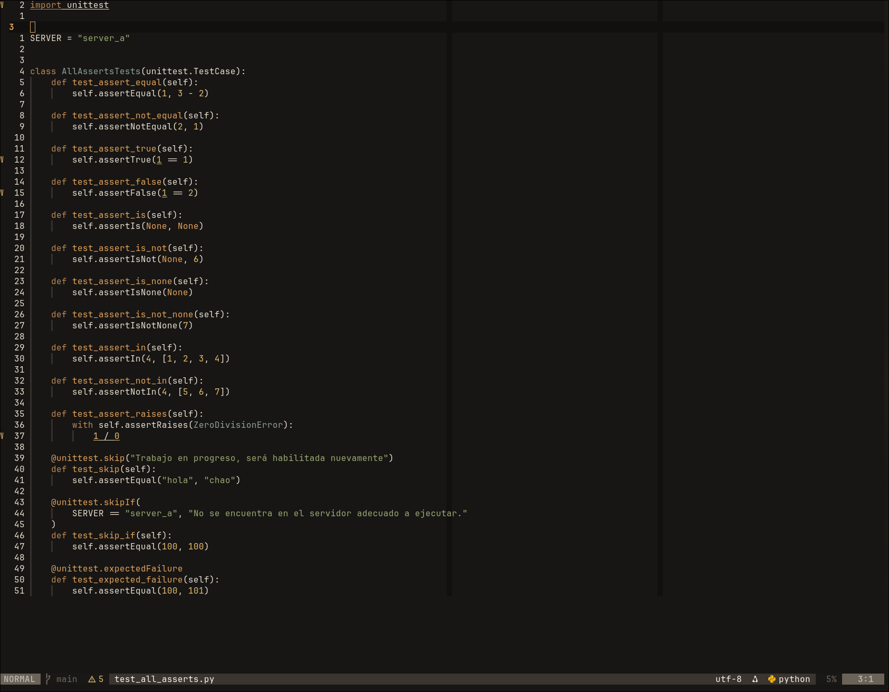
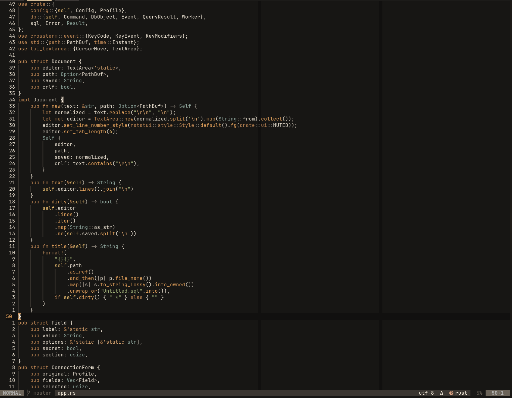
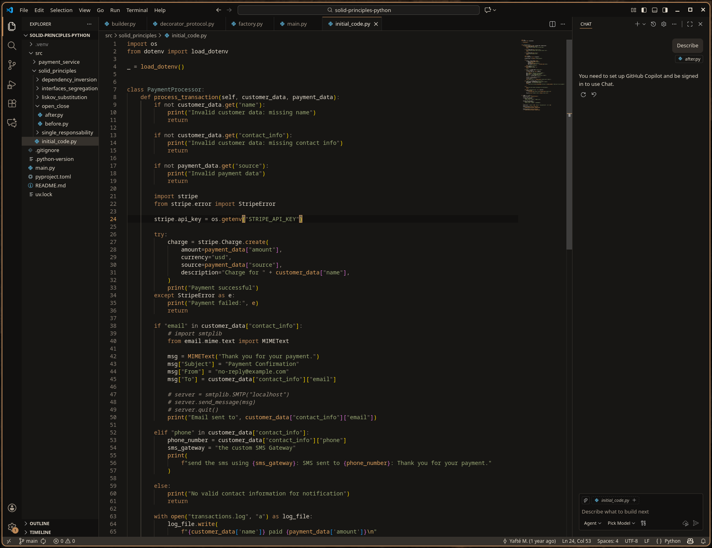

<p align="center">
  
</p>

# Black Ember

Black Ember is a warm, low-glare dark theme built around charcoal surfaces,
aged bronze, and restrained ember highlights. Its palette lives in one
canonical source so each supported editor can share the same visual language.

## Screenshots

### Neovim

<p align="center">
  
  
</p>

### Visual Studio Code

<p align="center">
  
</p>

## Available themes

- Neovim — available
- Visual Studio Code — in development

## Neovim

The Neovim colorscheme supports the core editor UI, legacy syntax groups,
Tree-sitter, LSP semantic tokens and diagnostics, diffs, GitSigns, Telescope,
and `nvim-cmp`.

### Install with lazy.nvim

```lua
{
  "RedYaafte/black-ember",
  name = "black-ember",
  lazy = false,
  priority = 1000,
  config = function()
    require("black-ember").setup({
      transparent = false,
      italic_comments = true,
    })
    vim.cmd.colorscheme("black-ember")
  end,
}
```

### Install with Neovim packages

```sh
git clone https://github.com/RedYaafte/black-ember \
  ~/.local/share/nvim/site/pack/black-ember/start/black-ember
```

Then add the following to your `init.lua`:

```lua
require("black-ember").setup()
vim.cmd.colorscheme("black-ember")
```

### Options

```lua
require("black-ember").setup({
  transparent = false, -- Do not set a background for editing windows.
  italic_comments = true,
})
```

## Palette

[`palette/black-ember.toml`](palette/black-ember.toml) is the canonical color
definition. Editor implementations should map their native highlight tokens to
its semantic roles instead of introducing unrelated colors.

## License

[MIT](LICENSE)
